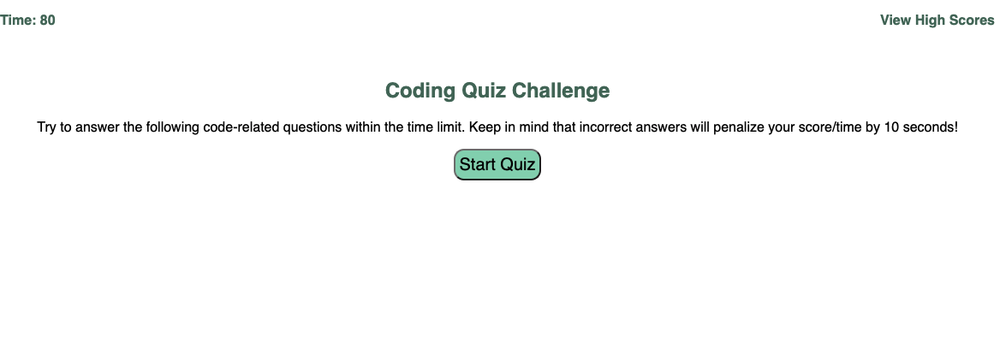
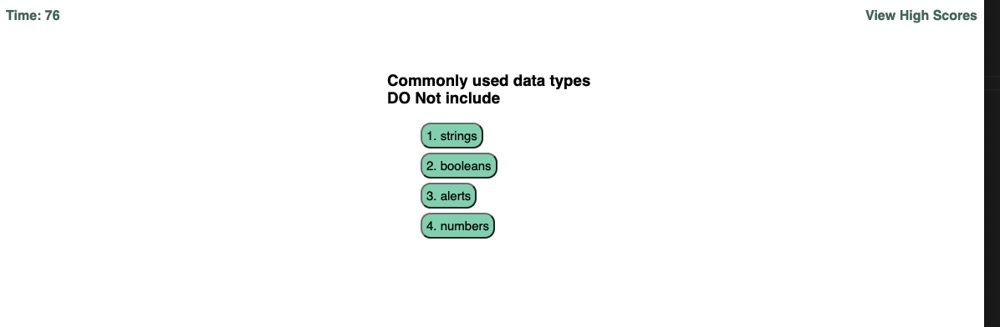
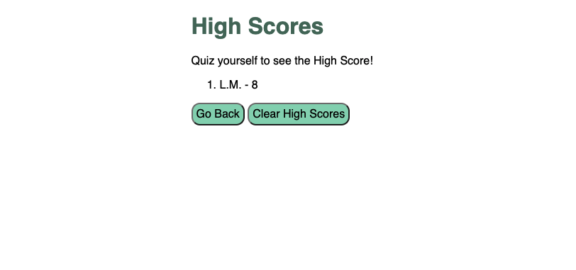

# Coding_Quiz
Coding_Quiz

 As coding boot camp student, I want to gauge my progress compared to my peers.
 A user can take a code quiz when they click the Start button to trigger the event.
 A user can see a time start, and then expect to be presented with a question.  
 A user can answer a question, and then expect to be presented with another question.
 If a user answers a question incorrectly, they should see their 15 seconds subtracted from the clock.
 A user can see that all questions are answered or the timer reaches 0, and expect the game to be over.
 A user can see that when the game is over, they should be able to save their initials and score. 

 Link to view <a href="https://lemming97.github.io/Coding_Quiz/">Coding Quiz</a>

 
 
 